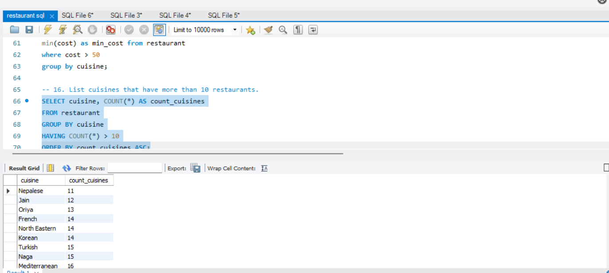
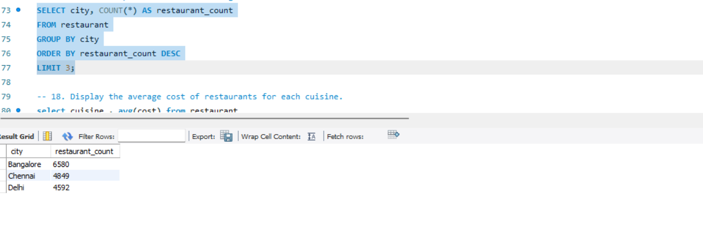
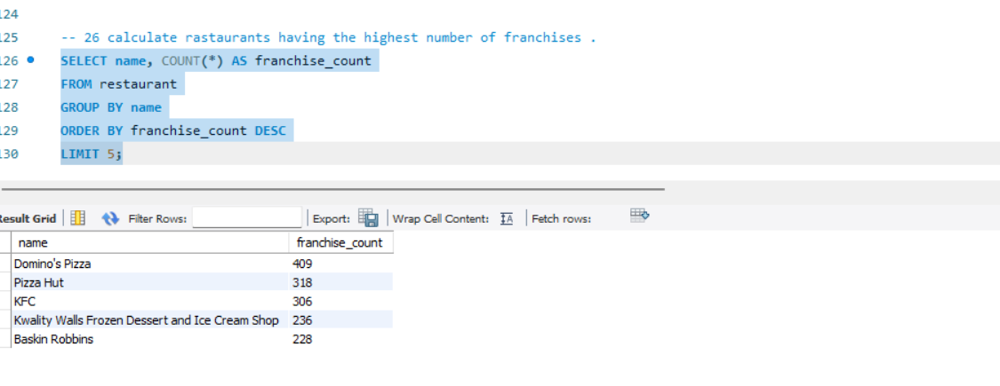
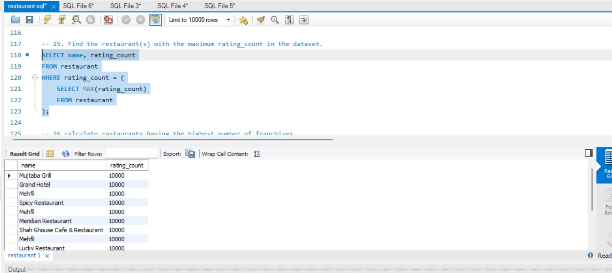

# 🍔 Swiggy Restaurant Data Analysis — SQL Project

---

## 📌 Project Overview

This project analyzes a real-world Swiggy restaurant dataset using **MySQL**. The goal was to explore restaurant distribution, pricing patterns, cuisine trends, and ratings across Indian cities to uncover meaningful business insights.

---

## 📂 Dataset

| Column | Description |
|--------|-------------|
| `id` | Unique restaurant ID |
| `name` | Restaurant name |
| `city` | City of the restaurant |
| `rating` | Customer rating (1.0 – 5.0) |
| `rating_count` | Number of ratings received |
| `cuisine` | Type of cuisine served |
| `cost` | Average cost for two (₹) |
| `link` | Swiggy URL |

- **Total Records:** 61,425 restaurants
- **Cities Covered:** 534 cities across India
- **Cuisines Available:** 108 cuisine types
- **Cost Range:** ₹1 – ₹3,000 (Average: ₹297.6)
- **Rating Range:** 1.0 – 5.0 (Average: 3.89)

---

## 🔍 SQL Queries Performed

### 🔹 Basic Queries
- Selected all restaurants and displayed names with cities
- Filtered restaurants by city (Bangalore)
- Found restaurants with rating > 4.0 and cost ≤ ₹300
- Listed all distinct cuisine types

### 🔹 Sorting & Filtering
- Top 5 restaurants by highest rating
- Restaurants with rating count > 1,000
- Restaurants ordered by cost (ascending)
- Restaurants with cost above average

### 🔹 Aggregation & Grouping
- Total restaurant count in dataset
- Average cost and rating per city
- Restaurant count per city
- Max & min cost per cuisine
- Total rating count per city
- Average rating per cuisine (descending)

### 🔹 HAVING Clause
- Cuisines with more than 10 restaurants
- Cities where average rating > 4.0
- Cities with more than one cuisine type

### 🔹 Subqueries
- Restaurants with cost above the overall average
- Restaurants with the highest rating in their city
- Restaurant with the maximum rating count in the dataset

### 🔹 Advanced
- Top 3 cities with the highest number of restaurants
- Top 5 restaurant chains with the most franchises
- Created a VIEW for city-wise restaurant count

---

## 📸 Screenshots

### Cuisines with More Than 10 Restaurants (HAVING Clause)

### Top 3 Cities by Restaurant Count

### Top 5 Franchise Chains

### Most Rated Restaurants (Subquery)

---

## 💡 Key Insights

- **Bangalore** has the highest number of restaurants (6,580), followed by Chennai (4,849) and Delhi (4,592)
- **Domino's Pizza** has the most franchise locations (409), followed by Pizza Hut (318) and KFC (306)
- **108 different cuisine types** are available on Swiggy across India
- The **average cost** for two is approximately **₹297**
- Multiple restaurants have a **rating count of 10,000** — indicating very high customer engagement

---

## 🛠️ Tools Used

- **MySQL** — Database creation, querying, and analysis
- **SQL Concepts** — SELECT, WHERE, GROUP BY, HAVING, ORDER BY, Subqueries, Views, Aggregate Functions

---

## 📁 Files in This Repository

| File | Description |
|------|-------------|
| `restaurant.csv` | Raw dataset used for analysis |
| `swiggy_analysis.sql` | All 26 SQL queries |
| `README.md` | Project documentation |

---

## 👩‍💻 Author

**Taniya Jain**  
MBA Student | Aspiring Data Analyst  
[LinkedIn](https://www.linkedin.com/in/taniya-jain-542118229) • [GitHub](https://github.com/Tani0310)
